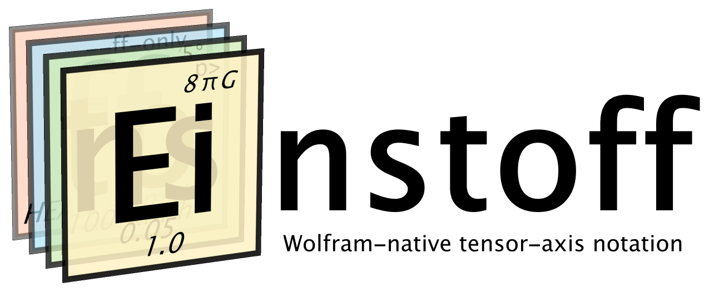

<p align="center">
  
</p>

# Einstoff

Einstoff is an experimental Wolfram Language package for writing tensor and
array-axis transformations as Wolfram expressions instead of string mini-languages.
It uses native pattern objects such as `a_`, `_`, `__`, `___`, `CircleTimes` (`⊗`),
`CirclePlus` (`⊕`), `Slot`, `Highlighted`, and `Framed` as surface notation. A held
description is compiled into a private staged IR; native patterns are not the semantic
AST after capture.

Einstoff is published through both Wolfram repositories:

- The [`Gravifer/Einstoff` paclet](https://resources.wolframcloud.com/PacletRepository/resources/Gravifer/Einstoff/)
  contains the implementation, installed documentation, and native paclet interface.
- [`ResourceFunction["Einstoff"]`](https://resources.wolframcloud.com/FunctionRepository/resources/Einstoff/)
  is a thin discoverability facade that loads and forwards to the published paclet.

## What It Does

Inspired by [einx](https://github.com/fferflo/einx),
Einstoff covers a growing subset of ein-style array notation:

- `Einstoff[ArrayReshape]` for bijective rearrange/reshape operations.
- `Einstoff["Massage"]` for the permissive single-tensor structural engine, including
  repetition, direct sums, and pairwise within-tensor contraction.
- `Einstoff["ArrayContract"]` for the no-repetition reshape-and-contract subset.
- `Einstoff[ArrayReduce][f]` for targeted reductions.
- `Einstoff[Operate][f]` for shape-preserving targeted block operations.
- `Einstoff[Map][f]` for general targeted block maps.
- `Einstoff[Dot]` and `Einstoff[Inner][mul, add]` for cross-tensor contractions.
- `Einstoff[Join]` and `Einstoff[Split]` for structural direct sums.
- `Einstoff["einsum"]` for the implemented pairwise einsum-style subset.

The comprehensive public reference and examples are on the
[`ResourceFunction["Einstoff"]` page](https://resources.wolframcloud.com/FunctionRepository/resources/Einstoff/).
The [paclet page](https://resources.wolframcloud.com/PacletRepository/resources/Gravifer/Einstoff/)
provides installation instructions and the native guide and symbol reference.
[`docs/Einstoff.en.md`](docs/Einstoff.en.md) is the repository's Markdown reference
draft. Developer and agent-facing design notes live under [`.agents/`](.agents/).

## Example

```mathematica
PacletDirectoryLoad[Directory[]];
Needs["Gravifer`Einstoff`"];

x = ArrayReshape[Range[2*3*4], {2, 3, 4}];

Einstoff[ArrayReshape][
  {{a_, b_, c_}} :> {{c, a, b}},
  {x}
]
```

The shape description above says: infer axes `a`, `b`, and `c` from the input, then
return the same data with axes ordered as `c, a, b`.

Targeted axes use Wolfram wrappers rather than einx's bracket syntax:

```mathematica
Einstoff[ArrayReduce][Total][
  {{a_, Slot["b"]}} :> {{a}},
  {ArrayReshape[Range[6], {2, 3}]}
]
```

## Repository Layout

- `Gravifer__Einstoff/` is the publisher-qualified paclet source directory.
- `docs/Einstoff.en.md` is a Markdown reference draft; the live Wolfram repository
  pages are the public references.
- `tests/*.wlt` are the source unit tests.
- `tests/python/*.wlt` are opt-in cross-validation tests against `einx`, `einops`, and
  NumPy where applicable.
- `tests/EinstoffTestSuite.nb` is generated from the `.wlt` tests for maintainer use.
- `.agents/agents.md`, `.agents/SPEC.md`, and `.agents/plans/` are developer and coding
  agent materials.

## Getting Started

For ordinary use with Wolfram Language 15.0 or newer, install and load the published
paclet:

```mathematica
PacletInstall["Gravifer/Einstoff"];
Needs["Gravifer`Einstoff`"];
```

Alternatively, use the published
[`ResourceFunction["Einstoff"]`](https://resources.wolframcloud.com/FunctionRepository/resources/Einstoff/)
as the operator-selecting entry point.

For source development, have your own Wolfram Language system ready. The test suite
runs through `wolframscript`.

Python is used only for the optional cross-validation harness:

```powershell
uv sync
```

Run the default Wolfram-only suite from the repository root:

```powershell
wolframscript -script scripts/run-tests.wls -q
```

Run optional Python cross-validation:

```powershell
wolframscript -script scripts/run-tests.wls python -q
```

For release validation, regenerate the native documentation, validate the source
paclet, build an archive, and rerun the suite against the extracted artifact:

```powershell
pwsh -NoProfile -File scripts/validate-release.ps1 -ExpectedTag v0.2.0
```

Add `-Python` to include the optional Python cross-validation suite. The release
script writes only to the ignored `build/` directory and temporary extraction space;
it does not install the candidate into the normal user paclet repository. Canonical
source uses Wolfram Language 15's public structured-package vocabulary; release
artifacts are built through the provisional compatibility compiler described in
[`docs/StructuredPackageCompatibility.md`](docs/StructuredPackageCompatibility.md),
which generates a temporary legacy-format tree mechanically.

To inspect the source paclet separately, install the checksum-verified PacletCICD
version pinned by this repository, then check or build with the same tooling used by
CI:

```powershell
wolframscript -script scripts/install-paclet-cicd.wls
wolframscript -script scripts/paclet-cicd.wls check
wolframscript -script scripts/paclet-cicd.wls submission-check
wolframscript -script scripts/paclet-cicd.wls build
```

Run `check` before `build`; the build command does not repeat the definition-notebook
inspection. `submission-check` performs a non-authenticated, non-submitting repository
preflight. The ordinary GitHub workflow selects free or licensed phases from the changed
files, and deliberately avoids hosted Python cross-validation. Fork pull requests
receive free checks; contributors with their own entitlement can run the licensed
workflow in their fork.

## Releases and Publication

Signed stable version tags publish a validated, attested GitHub Release and then wait
for explicit maintainer approval before submitting the same tagged source commit to the
[Wolfram Paclet Repository](https://resources.wolframcloud.com/PacletRepository/resources/Gravifer/Einstoff/),
with provenance recorded in a release manifest. Prereleases remain GitHub-only, and
manual dispatches remain non-publishing dry runs. Einstoff also has a companion facade
in the
[Wolfram Function Repository](https://resources.wolframcloud.com/FunctionRepository/resources/Einstoff/).
Function Repository updates remain separately reviewed and manual.

See [`CONTRIBUTING.md`](CONTRIBUTING.md) for the CI selection policy, fork workflow,
PacletCICD fallback installation, protected publication environment, token rotation,
failure recovery, and detailed maintainer release sequence. Maintainers synchronize
`main` and release tags to Codeberg explicitly.

## Status

[`Gravifer/Einstoff` 0.2.0](https://resources.wolframcloud.com/PacletRepository/resources/Gravifer/Einstoff/)
and [`ResourceFunction["Einstoff"]` 1.0.0](https://resources.wolframcloud.com/FunctionRepository/resources/Einstoff/)
are published. The paclet remains experimental and pre-1.0: the public API is usable,
while the supported notation and diagnostics may continue to evolve with user
feedback.

## License

Einstoff is licensed under the GNU General Public License v3.0 or later. See
[`LICENSE`](LICENSE).
